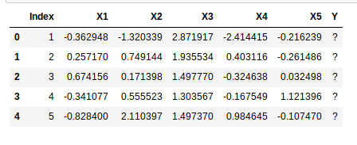
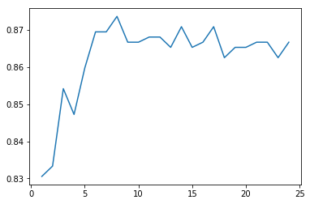

# K-Nearest Neighbors
Artificial Intelligence Course Assignment: Data Classification.

## Description
K-nearest neighbors algorithm (k-NN) is a non-parametric method used for classification and regression.[1] In both cases, the input consists of the k closest training examples in the feature space. The output depends on whether k-NN is used for classification or regression.

This repository is my work project as student of Artificial Intelligence course. The main problem is to build a classification system using K-Nearest Neighbors method to determine class/label of data testing in file DataTest_Tugas3_AI.csv.

## Problem

## Method

## Result

## Conclusion

## Disclaimer
DO NOT USE THIS PROJECT AS YOUR SUBMISSION FOR AI COURSE WORK ASSIGNMENT.