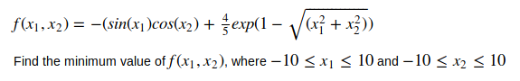
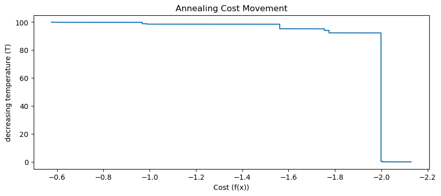

# Simulated Annealing
Artificial Intelligence Course Assignment: Minimum Value Problem.

## Description
Simulated Annealing is a method for solving unconstrained and bound-constrained optimization problems. The method models the physical process of heating a material and then slowly lowering the temperature to decrease defects, thus minimizing the system energy.

This repository is my work project as teaching assistant for Artificial Intelligence course. The main problem of the project is to search the minimum value of the given formula. The optimum value of the formula is -2,17..

## Problem

## Hyperparameter
1. Searching range = -10 - 10.
2. Initial Temperature = 100 - A temperature to start with.
3. Final Temperature = 0.0001 - A minimum temperature that control the search when to stop.
4. Number of iterations at particular temperature = 100.
5. Alpha = 0.9999 - Multipler of Temperature to reduce its value, used in Temperature Scheduling).

## Result

As described above, the result will approach the optimum value  because of hyperparameter as I defined above.

## Conclusion
The result will approaching the optimum value of the formula and reach accuracy score up to 98%.

## Disclaimer
DO NOT USE THIS PROJECT AS YOUR SUBMISSION FOR AI COURSE WORK ASSIGNMENT.