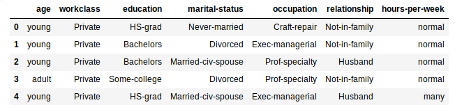

# Naïve Bayes
Machine Learning Course Assignment: Income Classification.

## Description
In machine learning, Naïve Bayes classifiers are a family of simple "probabilistic classifiers" based on applying Bayes' theorem with strong (naive) independence assumptions between the features. 

This repository is my work project as student of Machine Learning course. The main problem is to build a classification system using Naïve Bayes method to determine class/label of data testing in file TestsetTugas1ML.csv.

## Problem

## Exploratory Data Analysis

## Method

## Result

## Conclusion

## Disclaimer
DO NOT USE THIS PROJECT AS YOUR SUBMISSION FOR ML COURSE WORK ASSIGNMENT.